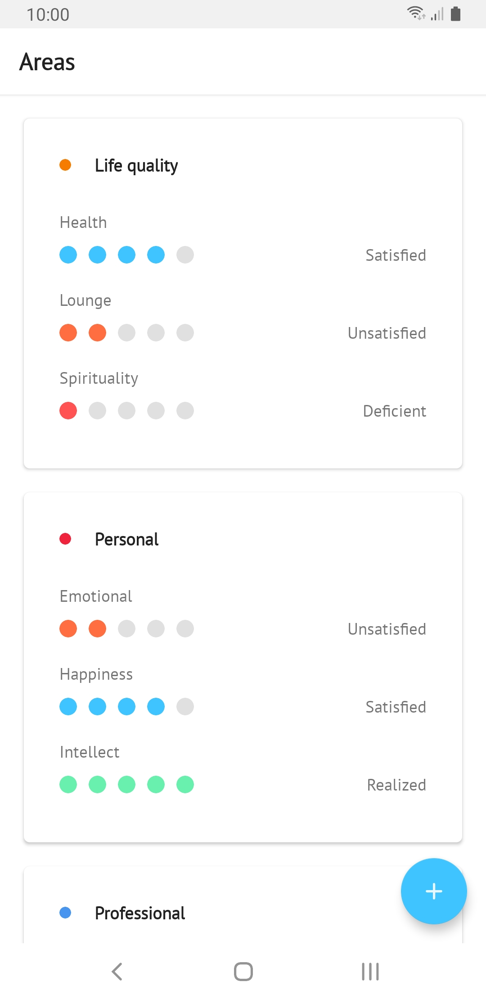
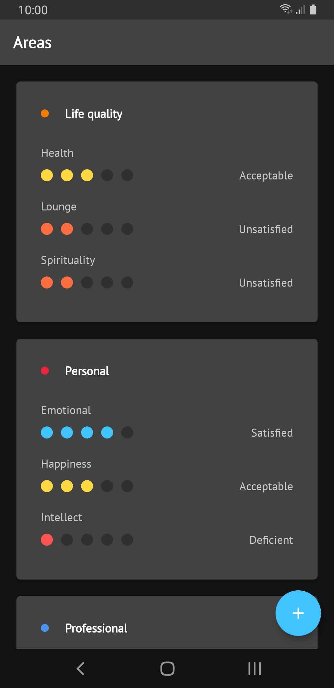

# Vita
A life manager app for Android.

    
    

**NOTE: This project is still a work in progress!**

## Getting started

If you want to build and run this application in your local machine, follow these steps:

1. Run the following command in CMD: ``git clone https://github.com/jeanbarrossilva/Vita``
2. Open Android Studio; if you're in the landing page, click "Open an Existing Project". Else, go to "File" -> "Open" and select the cloned project from the Downloads folder.
3. Click the play button. Voilà!